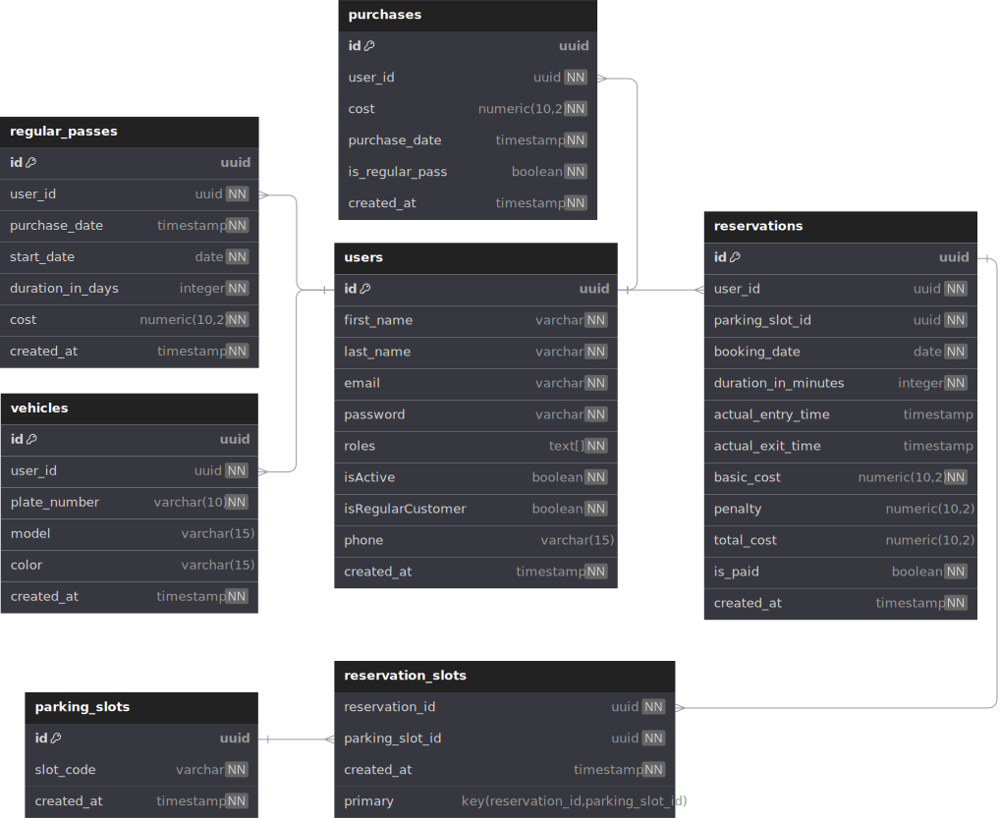

# GaragePro

This project is a web application for managing a parking system, where users can book parking spots for their vehicles. The system includes various functionalities, such as space reservations, booking management, and user authentication.

## Database Schema

The database for this application consists of several tables that store the necessary information related to parking spaces, reservations, users, and more. Below is an overview of the database schema and the relationships between the entities.

### Entity Relationship Diagram

The diagram shows the relationships between the main entities: `users`, `vehicles`, `reservations`, and others.



## Contribute

To set up and run this project locally, follow these steps:

### 1. Clone the repository

```
git clone https://github.com/seba-pitra/GaragePro-back.git
```

### 2.Install dependencies

```
yarn install
```

### 3.Create Environment Variables

You'll need to create a .env file to get the ball rolling. Copy and paste the .env.template file and put your values in the variables

### 4. Set Up the Database with Docker Compose

This project uses Docker Compose to set up the PostgreSQL database. To create and run the database container:

1. Make sure you have Docker and Docker Compose installed on your machine.
2. In the project directory, create the Docker containsers by running:

```
docker-compose up -d
```

### 5. Start the application

Once the database is configured, you can start the application:

```
yarn start:dev
```
